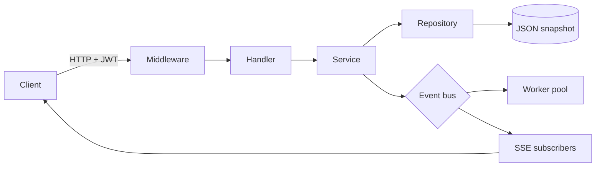

# StudyFlow 架构说明

## 请求与事件路径



HTTP 层只负责协议转换，service 层负责输入规则、所有权检查和状态变化，repository 负责并发安全的数据访问。领域事件在业务写入成功后发布；worker pool 和 SSE 是同一事件的不同订阅者。

## 并发模型

`Memory` 用一个 `sync.RWMutex` 保护多个聚合的映射。返回包含 slice 的对象前会复制 slice，避免调用方绕过锁修改共享内存。复习操作通过 `ApplyReview` 在同一个写锁内同时更新卡片和追加历史，保持原子性。

`Bus` 的订阅表由读写锁保护。发布过程不会等待慢订阅者：每个订阅者有独立有界缓冲区，满时增加原子 dropped 计数。这种选择优先保证 API 延迟，适合实时 UI 等允许重新拉取的投影，不适合付款等不可丢事件。

worker pool 让多个 goroutine 消费同一个订阅 channel，因此每个后台事件只会由其中一个 worker 处理。SSE 客户端各自订阅，所以它们得到广播副本。请求 context、进程 signal context 和 `http.Server.Shutdown` 共同负责取消。

## 领域规则

### 任务状态机

```text
todo <--> in_progress --> done
  |          |             |
  +------> cancelled       +--> todo (重新打开)
cancelled --> todo
```

规则集中在 `allowedTaskTransition`，不会因增加 CLI、gRPC 或消息消费者而重复。

### 间隔复习

新卡初始 ease factor 为 2.5。第一次答对间隔为 1 天，第二次为 6 天，之后基于旧间隔、ease factor 和回答修正系数增长。Again 会重置学习次数，Hard 降低 ease，Easy 提高 ease 并扩大间隔。算法是无 I/O 的纯函数，可单独实验和替换。

## 一致性边界

- 每次仓储方法是本进程内的原子操作。
- `ApplyReview` 表达一个跨卡片与复习记录的事务意图。
- JSON 快照包含版本号，写入临时文件后再替换目标文件。
- 事件目前在写入完成后发布，进程在两者之间崩溃可能漏事件。

引入 PostgreSQL 时，建议让仓储方法接收事务，并在同一事务写入 `outbox_events`。独立 relay 使用 `FOR UPDATE SKIP LOCKED` 批量发布，再标记完成，从而得到至少一次投递语义。事件消费者需要用 event ID 去重。

## 替换 PostgreSQL 的步骤

1. 在 `internal/store/postgres` 实现 `store.Repository`。
2. 将 `CreateTask` 等单聚合方法映射为普通事务。
3. 将 `ApplyReview` 映射为“锁卡片、更新调度字段、插入 review”的单事务。
4. 在 `cmd/api/main.go` 中把 `store.NewMemory()` 替换为 PostgreSQL adapter。
5. 保留 memory adapter，用于快速测试和本地演示。

业务与 HTTP 代码无需改变，这正是窄接口和依赖倒置带来的收益。

## 生产化检查表

- 使用 Argon2id 或受审计的密码库，并为认证接口加入 IP/账号双维度限流。
- 只允许明确配置的 CORS origin，强制 TLS，轮换 JWT 密钥。
- 增加 refresh token 家族、撤销与异常登录检测。
- 使用数据库唯一约束保证 email 唯一，使用版本列进行乐观并发控制。
- 为列表增加 cursor 和上限，为 SSE 增加连接配额。
- 对日志进行敏感字段审查；当前实现不会输出密码或 token。
- 增加 Prometheus 指标、OpenTelemetry trace、备份恢复演练和 SLO 告警。

